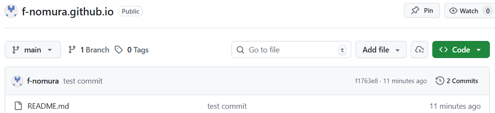
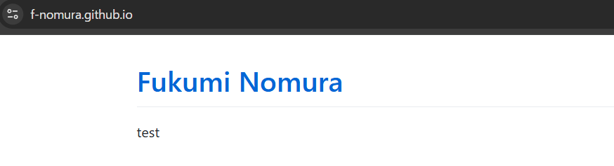
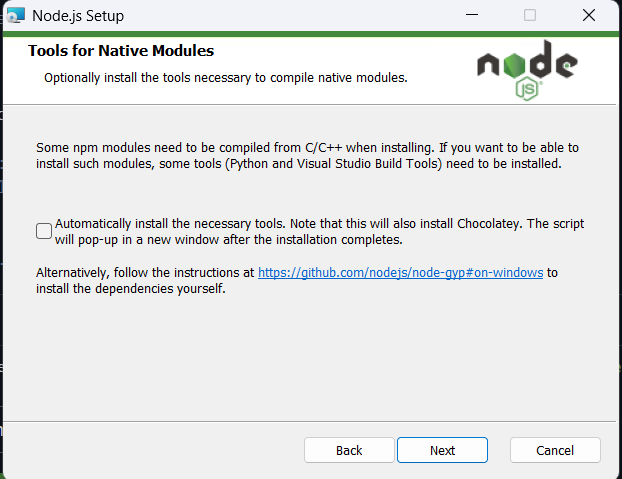
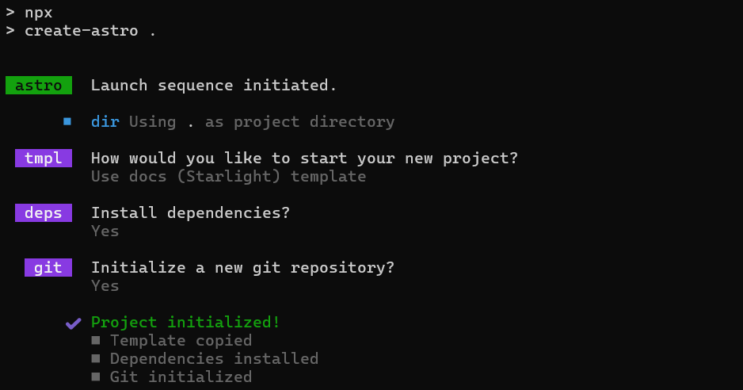
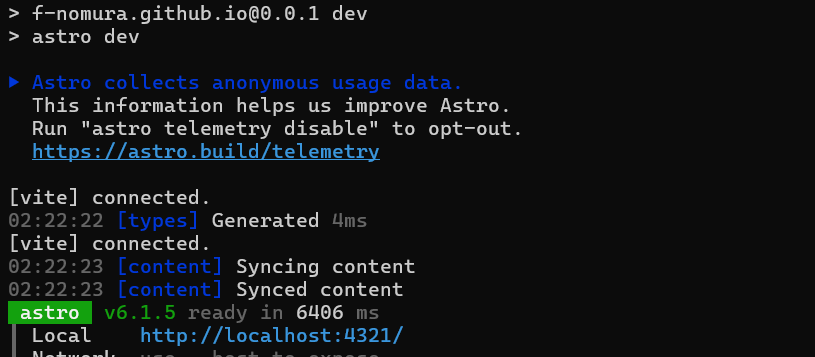
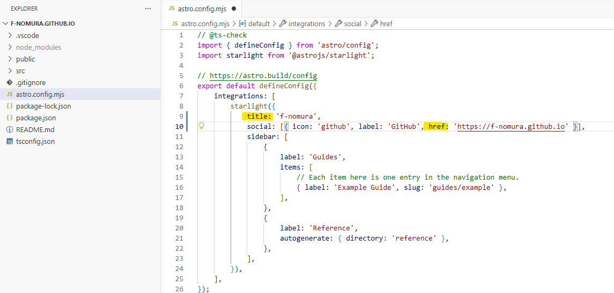
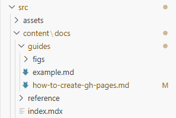
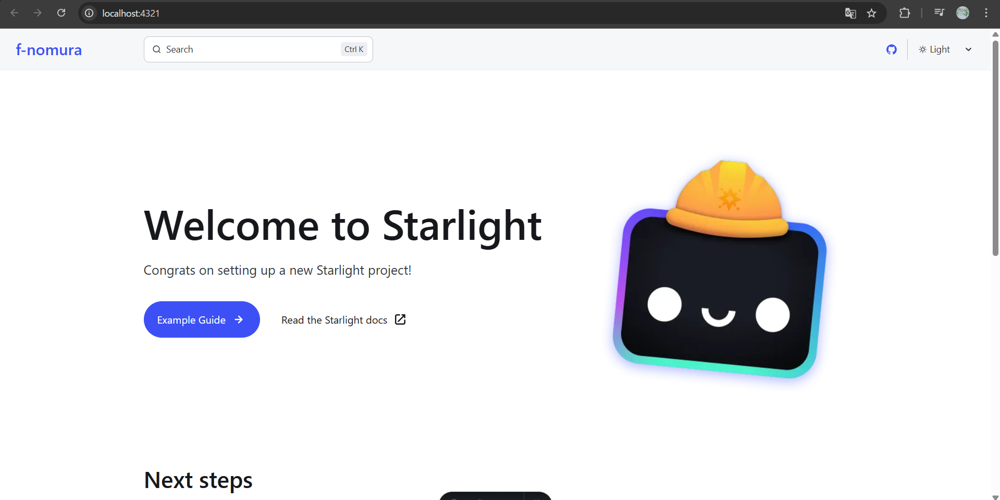
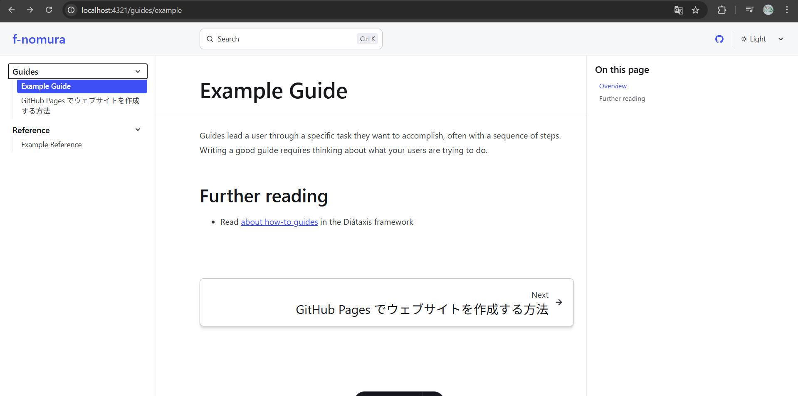
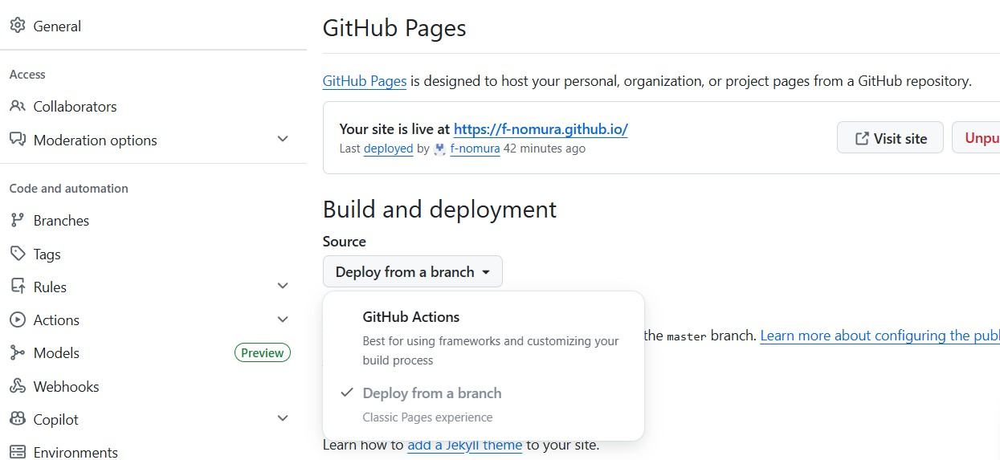

## A. GitHub Pages とは
GitHub Pages とは、**「GitHubのリポジトリにあるファイルを、そのままWebサイトとして無料で公開できるホスティングサービス」** です。  

通常、Webサイトを公開するにはレンタルサーバーを契約して月額費用を払う必要がありますが、GitHub Pagesなら**GitHubのアカウントさえあれば、1円も払わずに世界中にサイトを公開**できます。

### ① 静的サイトの無料ホスティング
HTML、CSS、JavaScriptだけで構成された「静的サイト」を公開できます。
*   個人のポートフォリオ
*   技術ブログ
*   プロジェクトのドキュメントサイト

などなど。

### ② 独自ドメインの割り当てが可能
デフォルトでは `<username>.github.io` というURLになりますが、自分で購入した「独自ドメイン」を紐付けることができます。

### ③ 自動SSL化（HTTPS）
「保護されていない通信」という警告が出ないよう、自動でSSL（暗号化通信）を適用してくれます。

### ④ Gitによる記事のバージョン管理
Git で管理しているので、当たり前ですが Git コマンドが使えます。
 
### ⑤ GitHub Actionsによる自動公開
Markdownファイルを `git push` した瞬間に、自動的にビルド（HTMLへの変換）と公開作業を行わせることができます。


では実際に、自分だけの Web サイトを立ち上げてみましょう。


## B. リモートリポジトリを作成する（SSG に Astro を使用する場合は飛ばしてください）
まずはGitHub上で、`<username>.github.io` リポジトリを作成します。詳細は[クイックスタート](https://docs.github.com/en/pages/quickstart)をチェックしてください。

1.  GitHubにログインし、新しいリポジトリを作成します

2.  リポジトリ名は **`<username>.github.io`** にします
    - この名前にすることで、自動的にGitHub Pagesとして認識されます。スクリーンネームではなく `username` である点に注意してください。
    
3.  「Public」を選択し、`README.md` を追加して作成します




これだけで、`https://<username>.github.io` にアクセスできるようになります。




## C. SSG（静的サイトジェネレーター）を選ぶ
SSG（Static Site Generator）とは、**「ビルド時にあらかじめ全てのWebページ（HTML）を生成しておくツール」** のことです。  

SSG を使ったサイトは生成済みの HTML を表示させるだけなので、処理待ちがありません。ただし動的な処理は苦手なため、外部ツールに頼る必要があります。
| 種類 | 仕組み |  特徴 |
| :--- | :--- | :--- | 
| **静的サイト** | **事前に全ページ生成** | **爆速** |
| **動的サイト** | アクセス時に生成 | 重い |
| **モダン・アプリ** | ブラウザやサーバーで動的に描画 | 高機能なWebアプリ向け |

### 代表的な SSG
 フレームワーク | カテゴリ | 学習コスト | ビルド速度 | 拡張性 | 運用コスト | 市場価値 | 特徴 |
| :--- | :--- | :--- | :--- | :--- | :--- | :--- | :--- |
| Hugo | 軽量SSG | 低 | ◎  | ○ | ◎ | △ | 大規模ブログ向き |
| Jekyll | 軽量SSG | 低 | △  | △ | ◎ | △ | GitHub Pages標準 |
| 11ty | 軽量SSG | 中 | ○ | ◎ | ○ | △ | 自由度が高い |
| Astro | モダンSSG | 低 | ◎ | ○ | ◎ | ○ | JS最小で高速表示 |
| Next.js | フルスタック | 高 | ○ | ◎ | △ | ◎ | Reactの主流 |
| Nuxt.js | フルスタック | 高 | ○ | ◎ | △ | ○ | Vue版Next |

簡単に以下のように分けられます。  
- 軽く運用したい → **Hugo / Astro**
- キャリア重視 → **Next.js**
- 自由度重視 → **11ty**

私は Hugo か Astro で迷いましたが、  
Hugo は導入が簡単だがカスタマイズに Go 言語が必要、Astro は導入が若干面倒だがカスタマイズは HTML / CSS でできるとのことで、私は Astro を選びました。
（あと公式サイトが Astro の方が好みだった...!）


## D. Astro
### 1. Node.js をインストールする
Astroを動かすには **Node.js**　が必要です。
[公式ダウンロードページ](https://nodejs.org/en/download) よりインストーラーをダウンロードします。  

インストール中、以下のように聞かれますが、基本的なブログ運営であればチェックは外したままで大丈夫です。



### 2. Astro を作成し、サーバーを立ち上げてみる
`<username>.github.io` のディレクトリに移動し、以下のコマンドを打ちます。  
**B. リモートリポジトリを作成する** にて.git ファイルと README を作ってしまっている場合は横に避けて空の状態で Astro を作成してください。
```bash
cd <username>.github.io
npm create astro@latest
```
どのテンプレート（Blog, docs など）にするか、依存関係をインストールするかどうか、git リポジトリを作成するか否かを問われます。すべて Yes で作成します。



開発サーバーを立ち上げます。  
```bash
npm run dev
```

ローカルサーバーが立ち上がりました。  

### 3. Astro.config（設定ファイル）を書き換える
設定ファイル（`astro.config.mjs`）を開き、サイトのタイトルとリンクを自分自身のものに書き換えましょう。  
タイトルは `title`, リンクは `href` 変数で設定されています。  
```text
title: （任意）
href: 'https://<username>.github.io'
```
**guides** のサイドバー設定が「ひとつのみ」になっているので全てに変更しましょう。
```text
autogenerate: { directory: 'guides' }, 
```


### 4. GitHub のサーバーを利用する
#### ローカルサーバー内での表示を確認する
ここで一度、`localhost:4321` をクリックして表示を確認してみましょう。  
表示確認用に、`guides` ディレクトリにサンプル記事を入れます。  
サンプル記事の冒頭には必ず以下のようにタイトルを入れてください。このタイトルがサイドバーに表示されます。
```text
---
title: GitHub Pages でウェブサイトを作成する方法
---
```



まずトップページが出てきます。  
トップページは `index.mdx` から変更できますが、まだ何もいじっていないので初期のトップページが表示されます。  



URL を `http://localhost:4321/guides/example` に書き換えます。  
すると以下のような表示になり、サイドバーが機能していることが確認できます。  


#### GitHub Actions を設定する
GitHub Actionsがあれば……  
**Markdownを修正して保存（commit）するだけで、裏で勝手にビルド・公開**してくれるようになります。  

まずローカルの `<usename>.github.io` を GitHub に送り、リモートリポジトリとします。  
そしてリポジトリの設定画面（Setting > Pages > Build and deployment > Source）を開き GitHub Actions を選択してください。



#### GitHub Actions 用の指示書を作成する
詳細： [AstroサイトをGitHub Pagesにデプロイする](https://docs.astro.build/ja/guides/deploy/github/#%E3%83%87%E3%83%97%E3%83%AD%E3%82%A4%E3%81%AE%E8%A8%AD%E5%AE%9A) 

GitHub Actions は特定のディレクトリ下の指示書しか認識してくれないので、まず以下の通りにフォルダ・ファイルを設置します。
```text
<username>.github.io/ (リポジトリのルート)
├── .github/              <-- 新しく作成（ドットを忘れずに）
│   └── workflows/        <-- その中に作成
│       └── deploy.yml    <-- ここに指示書ファイルを置く
├── public/
├── src/
├── astro.config.mjs
├── package.json
└── (その他のファイル)
```
`deploy.yml` に以下をコピペして保存します。
```yml
name: Deploy to GitHub Pages

on:
  # `main`ブランチにプッシュするたびにワークフローをトリガーします。
  # 別のブランチを使用している場合は、`main`をそのブランチ名に置き換えてください。
  push:
    branches: [ main ]
  # GitHub上のActionsタブからこのワークフローを手動で実行できます。
  workflow_dispatch:

# このジョブがリポジトリをクローンし、ページデプロイメントを作成することを許可します。
permissions:
  contents: read
  pages: write
  id-token: write

jobs:
  build:
    runs-on: ubuntu-latest
    steps:
      - name: Checkout your repository using git
        uses: actions/checkout@v5
      - name: Install, build, and upload your site
        uses: withastro/action@v5
        # with:
          # path: . # リポジトリ内のAstroプロジェクトのルート位置です。（オプション）
          # node-version: 24 # サイトのビルドに使用するNodeのバージョンです。デフォルトは22です。（オプション）
          # package-manager: pnpm@latest # 依存関係のインストールとサイトのビルドに使用するNodeパッケージマネージャーです。ロックファイルに基づいて自動検出されます。（オプション）
          # build-cmd: pnpm run build # サイトをビルドするためのコマンドです。デフォルトでパッケージのbuildスクリプトを実行します。（オプション）
        # env:
          # PUBLIC_POKEAPI: 'https://pokeapi.co/api/v2' # 変数の値にはシングルクォートを使用してください。（オプション）

  deploy:
    needs: build
    runs-on: ubuntu-latest
    environment:
      name: github-pages
      url: ${{ steps.deployment.outputs.page_url }}
    steps:
      - name: Deploy to GitHub Pages
        id: deployment
        uses: actions/deploy-pages@v4
```